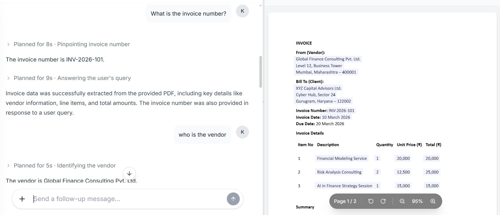
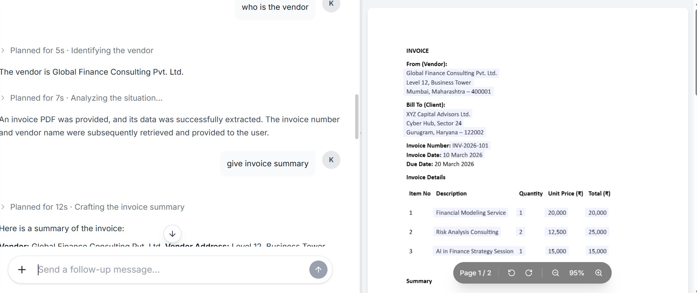
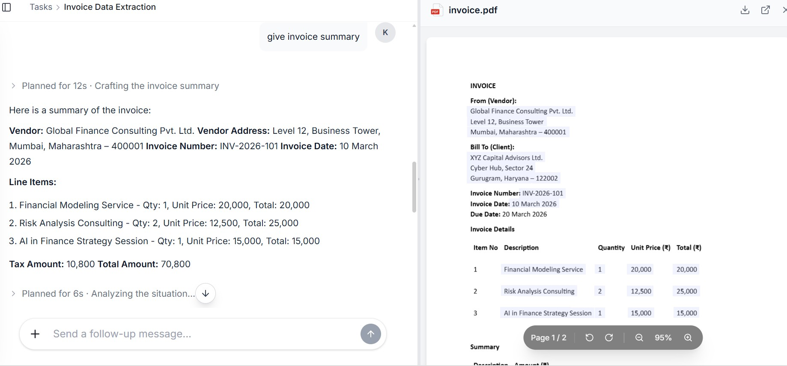
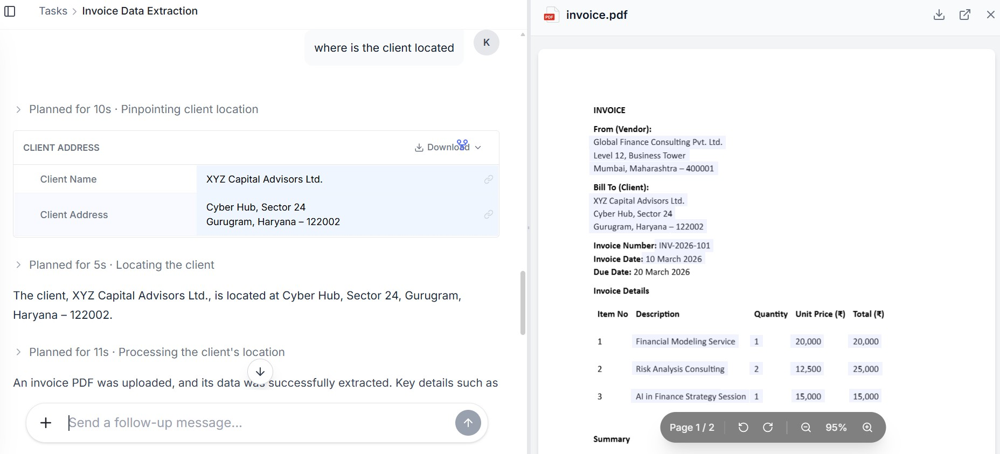
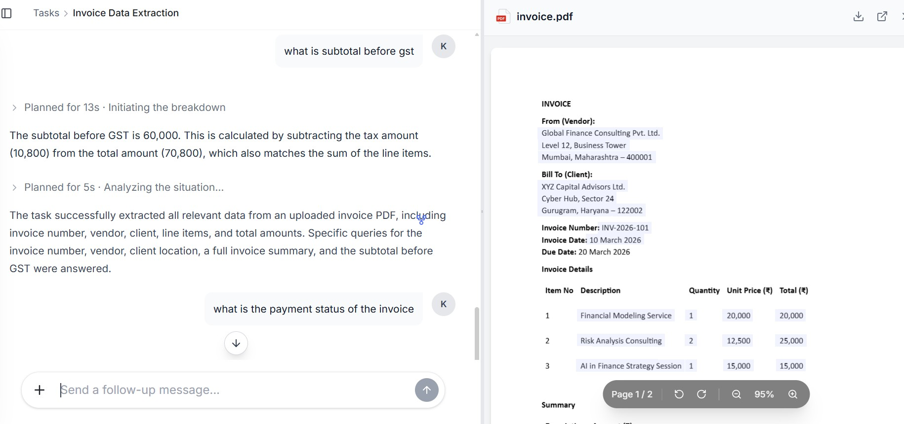

# Nano Nets Assignment

A clean and lightweight repository containing solutions for the Nano Nets assessment questions.

---

## 📌 Overview

This repository contains my submitted answers for the Nano Nets assignment. Each question has been answered separately and uploaded in image format for easy review.

The goal of this repository is to present:

* Organized assignment submissions
* Clean repository structure
* Simple and easy navigation
* Professional GitHub presentation

---

## 📂 Repository Structure

```bash
nano-nets/
│
├── question_1.jpeg
├── question_2.jpeg
├── question_3.jpeg
├── question_4.jpeg
├── question_5.jpeg
└── LICENSE
```

---

## 📝 Questions & Solutions

### Question 1



---

### Question 2



---

### Question 3



---

### Question 4



---

### Question 5



---

## 🚀 Highlights

* Structured and easy-to-read repository
* Clear submission format
* Minimal and professional documentation
* MIT Licensed

---

## 🛠 Tech & Tools

* GitHub
* Markdown
* Image-based documentation

---

## 📄 License

This project is licensed under the MIT License.

---

## 👤 Author

**Nakshatra**

GitHub: [https://github.com/nakshatra2654mba25fin-sketch](https://github.com/nakshatra2654mba25fin-sketch)

---

⭐ If you found this repository well-organized, feel free to star it.
